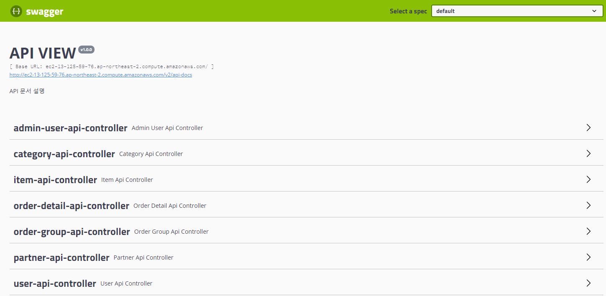
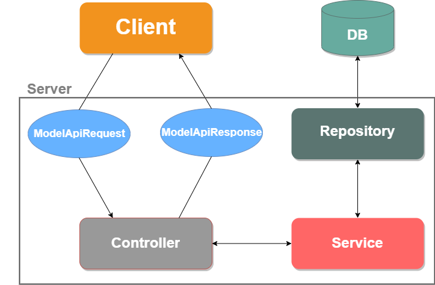
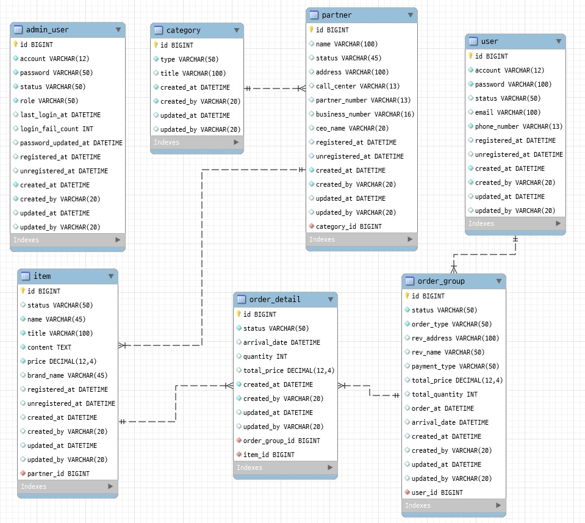

<h1 align="center"> STORE-JPA </h1> <br>

## 목차

- [소개](#소개)

- [개발환경](#개발환경)

- [REST API Reference](#rest-api-reference)

- [ERD](#erd)

## 소개
Store를 주제로 서버, 관리 페이지 개발 - JPA를 학습하고 추가적으로 Store에서 사용될 API를 개발

## 기술스택
* Server : Java 11, Spring Boot 2.4.1, JPA, MySql, Junit5, AWS EC2 

## 실행
1. repo clone
```
git clone https://github.com/hyungjun26/store-jpa.git
```
2. build
```
cd store-jpa/store-api
./gradlew build
```
3. jar 실행
```
cd build/libs
java -jar store-0.0.1-SNAPSHOT.jar
```

## REST API Reference 
- Swagger Doc: <http://ec2-13-125-59-76.ap-northeast-2.compute.amazonaws.com/swagger-ui.html#/>


| Method | Mapping               | Description                |
|--------|-----------------------|----------------------------|
| POST   | /api/adminUser        | 관리자 계정 생성           |
| PUT    | /api/adminUser        | 관리자 계정 수정           |
| GET    | /api/adminUser/{id}   | 관리자 ID로 정보 조회      |
| DELETE | /api/adminUser/{id}   | 관리자 ID로 정보 삭제      |
| POST   | /api/user             | 일반 사용자 계정 생성      |
| PUT    | /api/user             | 일반 사용자 계정 수정      |
| GET    | /api/user/{id}        | 일반 사용자 ID로 정보 조회 |
| DELETE | /api/user/{id}        | 일반 사용자 ID로 정보 삭제 |
| POST   | /api/partner          | 파트너사 계정 생성         |
| PUT    | /api/partner          | 파트너사 계정 수정         |
| GET    | /api/partner/{id}     | 파트너사 ID로 정보 조회    |
| DELETE | /api/partner/{id}     | 파트너사 ID로 정보 삭제    |
| POST   | /api/category         | 카테고리 생성              |
| PUT    | /api/category         | 카테고리 수정              |
| GET    | /api/category/{id}    | 카테고리 정보 조회         |
| DELETE | /api/category/{id}    | 카테고리 정보 삭제         |
| POST   | /api/item             | 상품 생성                  |
| PUT    | /api/item             | 상품 수정                  |
| GET    | /api/item/{id}        | 상품 정보 조회             |
| DELETE | /api/item/{id}        | 상품 정보 삭제             |
| POST   | /api/orderGroup       | 거래 내역 생성             |
| PUT    | /api/orderGroup       | 거래 내역 수정             |
| GET    | /api/orderGroup/{id}  | 거래 내역 정보 조회        |
| DELETE | /api/orderGroup/{id}  | 거래 내역 정보 삭제        |
| POST   | /api/orderDetail      | 거래 상세 정보 생성        |
| PUT    | /api/orderDetail      | 거래 상세 정보 수정        |
| GET    | /api/orderDetail/{id} | 거래 상세 정보 조회        |
| DELETE | /api/orderDetail/{id} | 거래 상세 정보 삭제        |

## API 동작 구조



## ERD
- admin_user : 관리자 정보
- partner : 제휴 파트너 정보
- item : 상품 정보
- category : 상품 카테고리 정보
- order_group : 거래 정보
- order_detail : 거래 상세 정보
- user : 고객 정보


